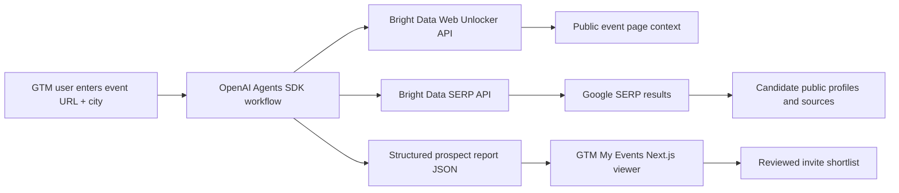

# Proposal: GTM My Events by Bright Data

## Executive Summary

**GTM My Events by Bright Data** is a Bright Data example application that shows how go-to-market teams can turn public web data into prioritized event invite lists. The prototype combines the **OpenAI Agents SDK**, **Bright Data Web Unlocker API**, and **Bright Data SERP API** to research a public event page, discover relevant public LinkedIn profiles through Google search results, gather evidence, score prospects, and present the output in a Bright Data-branded Next.js viewer.

The goal is to make the current project a partner-ready Bright Data demo: a practical GTM workflow that showcases Bright Data's strength in reliable public web access while demonstrating how AI agents can transform web data into a usable event planning asset.

## Intended Outcome

The completed demo should let a GTM or field marketing team:

1. Enter an event URL and target city.
2. Use Bright Data Web Unlocker API to reliably fetch public event context.
3. Use Bright Data SERP API to discover public search results for relevant people, companies, and communities.
4. Optionally fetch public profile or source pages for additional evidence.
5. Use an OpenAI Agents SDK workflow to reason over the event, searches, and evidence.
6. Produce a structured report containing prospects, fit scores, rationales, evidence, source queries, and caveats.
7. Review the report in a polished Bright Data example UI built for GTM teams.

The user-facing result is not a generic scraper. It is an event intelligence workflow: "who should we invite, why, and what public evidence supports that recommendation?"

## Why This Fits Bright Data

Bright Data is the data access layer that makes the workflow reliable enough for a real GTM use case.

- **Web Unlocker API** handles access to public event pages and optional public source pages that may be dynamic or protected by anti-bot systems.
- **SERP API** collects Google search results for city-qualified and topic-qualified prospect discovery.
- Bright Data's proxying, unblocking, retry, and parsing capabilities reduce the amount of custom crawling logic the application has to own.
- The final report makes Bright Data's value concrete: clean public web signals become a reviewable invite list.

The demo can also create a natural upsell path toward Bright Data's structured dataset products, such as a LinkedIn Scraper API workflow, when a customer needs more structured public LinkedIn profile data.

## Current Prototype

The current repo already implements the core stack:

- **Python backend agent**
  - OpenAI Agents SDK agent in `src/invite_finder/agent.py`
  - Function tools for event fetching, SERP search, and public profile page fetches
  - Structured output model for event prospect reports

- **Bright Data integration**
  - REST client in `src/invite_finder/brightdata.py`
  - Web Unlocker requests for event pages and optional public profile pages
  - SERP API requests for Google searches
  - API key and zone configuration through environment variables

- **Command-line workflow**
  - `invite-finder --event-url ... --city ... --output reports/...json`
  - Budget controls for max profiles, SERP queries, page fetches, and agent turns

- **Next.js report viewer**
  - Bright Data-themed app in `invite_viewer/`
  - Loads report JSON files from `reports/*.json`
  - Supports report switching, filtering, sorting, score review, evidence review, and JSON import

## Proposed Architecture

## Agent Workflow

1. **Event understanding**
   - Fetch the public event page through Web Unlocker.
   - Extract title, description, topic, audience, and event context.

2. **Search strategy generation**
   - Build broad-to-specific Google queries.
   - Include target city aliases, topic keywords, role keywords, company names, and community signals.

3. **SERP discovery**
   - Run searches through Bright Data SERP API.
   - Deduplicate public LinkedIn profile URLs and other relevant public results.

4. **Evidence enrichment**
   - Fetch selected public pages through Web Unlocker when snippets are promising but need validation.
   - Keep fetches budgeted and auditable.

5. **Candidate scoring**
   - Score candidates by topical fit, role/company fit, location confidence, and evidence quality.
   - Avoid unsupported claims and private contact data.

6. **Structured output**
   - Return report JSON with event summary, audience hypothesis, candidates, evidence, source queries, and caveats.

7. **GTM review**
   - Present the output in the Next.js viewer so a GTM team can filter, inspect, and export or operationalize the shortlist.

## Product Experience

The demo UI should read as a Bright Data example and a practical GTM workflow.

Primary screen:

- Product name: **GTM My Events by Bright Data**
- Positioning: "Turn public web data into event-ready invite lists."
- Active research run summary
- Metrics: prospects, top fit score, average fit, target accounts
- Report run sidebar
- Prospect controls: search, fit score, account filter, sort
- Prioritized prospect cards with score, account, rationale, location signal, evidence, and discovery queries
- Data notes and caveats

The language should make two things explicit:

1. This is a Bright Data example showing what can be built with Bright Data APIs.
2. This is a tool GTM teams can actually use when planning events.

## Scope to Make It Partner-Ready

### Phase 1: Demo hardening

- Keep the current CLI report generation path.
- Improve error messaging for Bright Data API failures.
- Add a sample event workflow with a known-good report.
- Add a one-command demo script that regenerates a report and launches the viewer.
- Confirm report JSON schema and document required fields.

### Phase 2: Hosted workflow

- Add a backend route or lightweight service so users can submit event URL, city, and budget settings from the UI.
- Stream progress events such as "fetching event", "running SERP query", "validating evidence", and "writing report".
- Persist generated reports locally or in a small database.
- Add CSV export for reviewed prospects.

### Phase 3: Bright Data showcase polish

- Add Bright Data API call visibility in the UI: which API was used, how many calls, and what each call contributed.
- Add a "data provenance" panel for source queries, fetched pages, and caveats.
- Add a demo mode with preloaded reports for fast stakeholder review.
- Add a compliance note emphasizing public web data, no login, no private contact enrichment, and human review before outreach.

## Demo Script for Bright Data Team

1. Open **GTM My Events by Bright Data**.
2. Show the Bright Data-framed hero and active event research run.
3. Explain that the JSON report was generated by an OpenAI Agents SDK workflow using Bright Data APIs.
4. Switch between report runs to show successful and zero-result searches.
5. Filter by account, such as NVIDIA, to show GTM-ready targeting.
6. Open a prospect card and show why the person was recommended.
7. Expand evidence and discovery queries to show provenance.
8. Explain how Web Unlocker handled public event/profile page fetching and SERP API handled Google discovery.
9. Close with the product direction: from example app to repeatable event intelligence workflow.

## Success Criteria

- A Bright Data team member can understand the value in under two minutes.
- The demo clearly shows Bright Data APIs as the data access layer.
- The agent output is structured, auditable, and bounded by usage budgets.
- Empty or failed search runs are explained with caveats rather than fabricated results.
- GTM users can filter and review prospects without reading raw JSON.
- The project can be extended from CLI-generated reports to a full UI-submitted workflow.

## Risks and Mitigations

- **SERP result variability**
  - Mitigation: show source queries, caveats, retries, and zero-result states.

- **Public profile access limitations**
  - Mitigation: use SERP snippets first, fetch only promising public pages, and consider Bright Data LinkedIn Scraper API for structured public LinkedIn data if needed.

- **Overclaiming candidate intent**
  - Mitigation: phrase candidates as "may be relevant" and include evidence, not certainty.

- **Cost and quota control**
  - Mitigation: keep budgets for SERP queries, page fetches, and agent turns visible and configurable.

- **Compliance and privacy expectations**
  - Mitigation: use public pages only, avoid login-gated flows, avoid private contact data, and require human review before outreach.

## Technical Stack

- **OpenAI Agents SDK**
  - Agent loop, function tools, structured output, tracing, and future handoffs or guardrails.

- **Bright Data Web Unlocker API**
  - Reliable public web page access for event pages and optional public source pages.

- **Bright Data SERP API**
  - Google search result collection for prospect discovery.

- **Python**
  - Agent runtime, Bright Data client, CLI, and report generation.

- **Next.js**
  - Bright Data-style GTM review interface for report JSON.

## References

- OpenAI Agents SDK quickstart: https://developers.openai.com/api/docs/guides/agents/quickstart
- OpenAI Agents SDK tools guide: https://developers.openai.com/api/docs/guides/tools#usage-in-the-agents-sdk
- Bright Data Web Unlocker API introduction: https://docs.brightdata.com/scraping-automation/web-unlocker/introduction
- Bright Data SERP API introduction: https://docs.brightdata.com/scraping-automation/serp-api/introduction
- Bright Data LinkedIn Scraper API introduction: https://docs.brightdata.com/datasets/scrapers/linkedin/introduction

## Proposed Ask to Bright Data

We would like feedback from the Bright Data team on:

1. Whether this demo accurately represents Web Unlocker API and SERP API positioning.
2. Whether LinkedIn Scraper API should be included as an optional structured-data path.
3. Which Bright Data metrics should be surfaced in the UI for a more compelling API showcase.
4. Whether Bright Data would prefer this as a CLI-first technical demo, a hosted interactive demo, or both.
5. Any brand, compliance, or messaging adjustments needed before presenting this externally.

